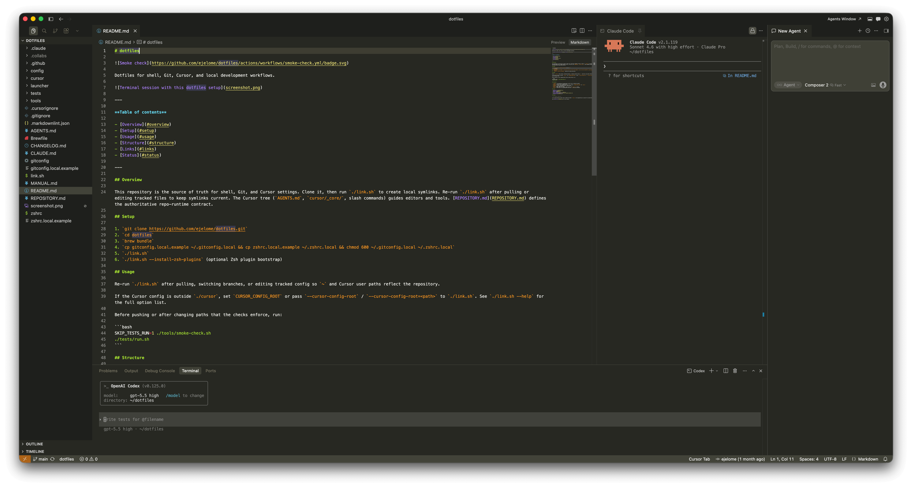

# dotfiles


Dotfiles for shell, Git, Cursor settings, and local development workflows.



---

**Table of contents**

- [Overview](#overview)
- [Setup](#setup)
- [Usage](#usage)
- [Structure](#structure)
- [Links](#links)
- [Status](#status)

---

## Overview

This repository is the source of truth for shell, Git, Starship, Cursor User settings, and local development tools. Clone it, then run `./link.sh` to create local symlinks. Re-run `./link.sh` after pulling or editing tracked files to keep runtime paths current. [REPOSITORY.md](REPOSITORY.md) defines the authoritative repo-runtime contract.

## Setup

1. `git clone https://github.com/ejelome/dotfiles.git`
2. `cd dotfiles`
3. `brew bundle`
4. `cp gitconfig.local.example ~/.gitconfig.local && cp zshrc.local.example ~/.zshrc.local && chmod 600 ~/.gitconfig.local ~/.zshrc.local`
5. `./link.sh`
6. `./link.sh --install-zsh-plugins` for optional Zsh plugin bootstrap.

## Usage

Re-run `./link.sh` after pulling, switching branches, or editing tracked config so `~` and Cursor User settings reflect the repository.

Before pushing or after changing paths that the checks enforce, run:

```bash
SKIP_TESTS_RUN=1 ./tools/smoke-check.sh
./tests/run.sh
```

Use `tools/cursor-cli/dcc` to launch role-specific Codex or Claude sessions when those CLIs are installed.

## Structure

- `.github/` — CI workflow for smoke checks and shell tests on Ubuntu and macOS
- `config/` — Starship shared configuration
- `cursor/` — Cursor User `settings.json` and `keybindings.json`
- `launcher/` — optional macOS Cursor workspace launcher setup scripts
- `tests/` — shell regression suite
- `tools/` — smoke checks, link helpers, CLI utilities, and support scripts
- `link.sh` — entry point for projecting this tree into runtime paths

## Links

- [REPOSITORY.md](REPOSITORY.md)
- [AGENTS.md](AGENTS.md)
- [CLAUDE.md](CLAUDE.md)

## Status

> Last updated: 2026-05-15

CI runs smoke checks and shell tests on Ubuntu and macOS. `link.sh` is the supported way to project this repository's shell, Git, Starship, and Cursor User configuration.
